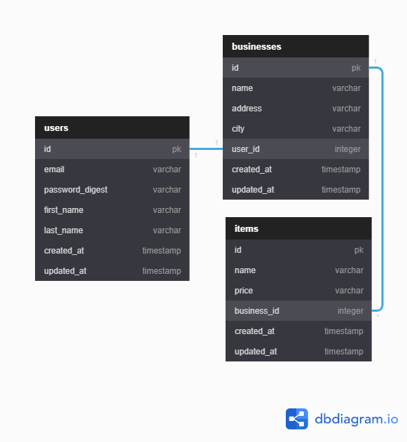

[]()
[]()

# Desafio Avaliativo de Ruby on Rails Aplicado pela T-Shop

Este é um desafio feito pelo time do [Taki App](https://takiapp.com.br/) e aplicado pela [T-Shop](https://www.tshopapp.com.br/), para avaliação dos meus conhecimentos em Ruby on Rails. O repositório original deste teste pode ser visto clicando [aqui](https://github.com/biancaquintan/taki-rails-interview). As instruções em português para este desafio podem ser visto clicando [aqui](doc/DESAFIO.md), ou originalmente em inglês clicando [aqui](doc/CHALLENGE.MD)


## Pré Requisitos

Este desafio foi escrito em 2016 e o mesmo não é compatível com os sistemas e pacotes mais recentes. Segue abaixo os requisitos:

- Ubuntu 18 LTS
- Ruby 2.0.0
- PostgreSQL
- libpq-dev
- NodeJS

## Execução em Windows

Caso você queira executar o Ruby on Rails no Windows. Recomendo atualiza-lo para a versão mais recente e usar o WLS2. Você poderá instalar a versão 18 do Ubuntu na Microsoft Store e usa-lo normalmente.

Para o banco de dados, recomendo instalar o docker, pois é mais fácil e simples de instalar.

## Banco de dados

A modelagem do banco de dados segue a figura abaixo:



## Instalação

Para facilitar fiz uma lista de comandos para executar em uma instalação limpa do projeto. Se você acabou de formatar ou criar uma máquina com o Ubuntu 18, basta executar os comandos abaixo na sequencia, alterando a parte escrita 'NOME_DO_USUARIO' para o seu usuário do ubuntu.

```

sudo apt update

sudo apt install gnupg2 libpq-dev nodejs

gpg2 --recv-keys 409B6B1796C275462A1703113804BB82D39DC0E3 7D2BAF1CF37B13E2069D6956105BD0E739499BDB

\curl -sSL https://get.rvm.io | bash -s stable

source /home/NOME_DO_USUARIO/.rvm/scripts/rvm

rvm install 2.0

bundle

rake db:create

rake db:migrate

rake db:seed

```

Após executar os comando acima levante o serviço com o comando:

```
rails serve
```

Você poderá visualizar a aplicação acessando http://localhost:3000 em seu navegador.

## Usuários para teste

```
Username: john@taki.com, Password: 000000
Username: jane@taki.com, Password: 111111
```

Duvidas? Pergunte-me.
